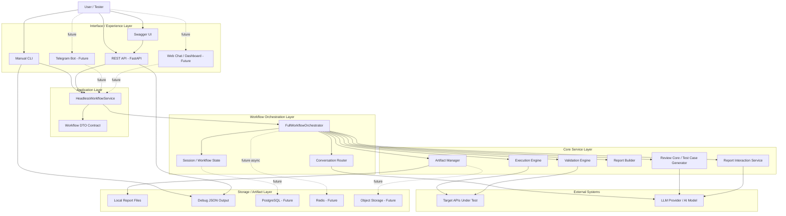
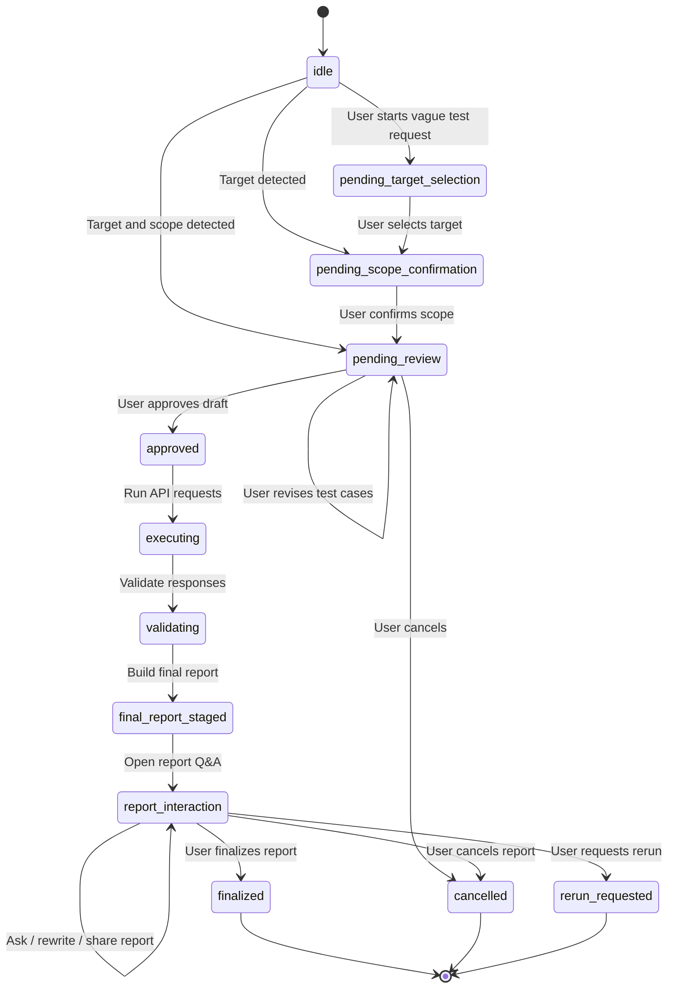
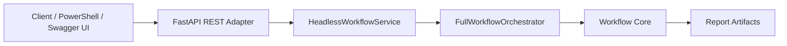
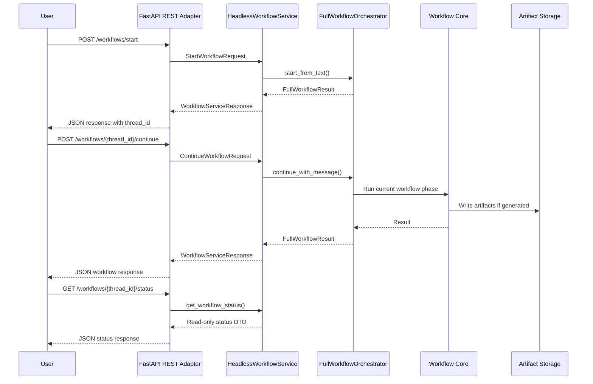
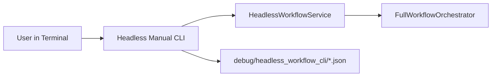
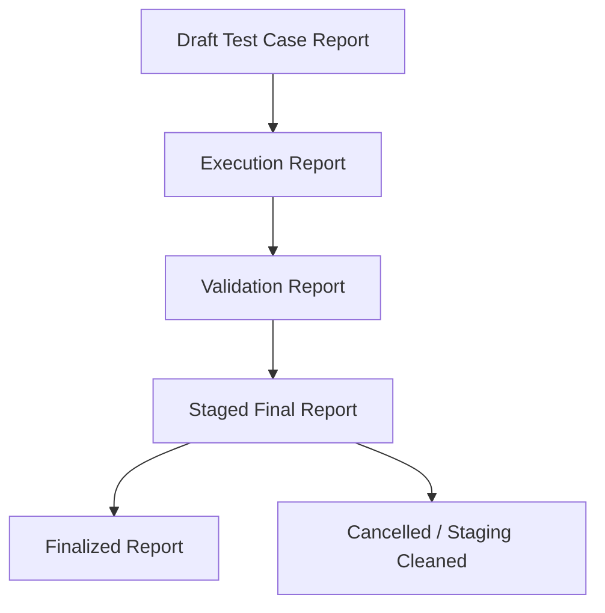
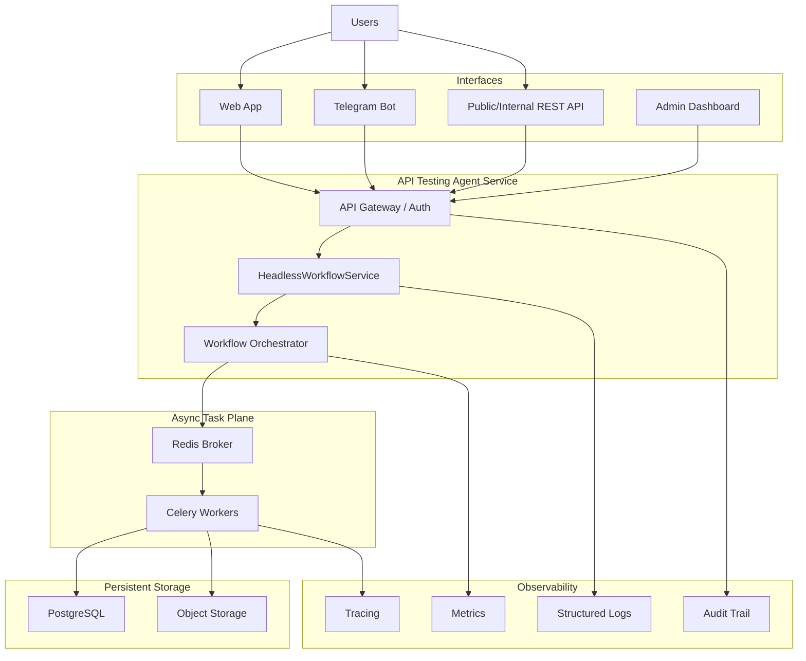

# System Architecture Diagram

## 1. Purpose

This document describes the system architecture of the **API Testing Agent** project.

The goal of the architecture is to show how the system is organized from user-facing interfaces to workflow orchestration, API testing execution, validation, report generation, and artifact storage.

This document is intended for:

- project report;
- technical documentation;
- demo preparation;
- system design explanation;
- future extension planning.

---

## 2. High-Level System Architecture



---

## 3. Main Architecture Layers

| Layer | Component | Responsibility |
|---|---|---|
| Interface Layer | CLI, REST API, Swagger UI | Receive user input and display workflow response |
| Application Layer | HeadlessWorkflowService | Provide stable service contract for all adapters |
| DTO Layer | Workflow DTO Contract | Standardize request and response shape |
| Workflow Layer | FullWorkflowOrchestrator | Coordinate workflow phases |
| Router Layer | Conversation Router | Understand message intent and route workflow |
| Core Service Layer | Review, Execution, Validation, Report | Generate test cases, run tests, validate results, build reports |
| External Layer | Target API, LLM Provider | External API testing target and AI reasoning provider |
| Storage Layer | Reports, debug files, future DB/object storage | Store workflow artifacts and debug outputs |

---

## 4. Interface Layer

The interface layer contains all entry points where a user or external client can interact with the system.

Current interfaces:

```text
Manual CLI
FastAPI REST API
Swagger UI
```

Future interfaces:

```text
Telegram Bot
Web Chat
Admin Dashboard
Internal SDK
```

Important rule:

```text
Interfaces must not call workflow core directly.
Interfaces must call HeadlessWorkflowService.
```

---

## 5. Application Layer

The application layer is centered around:

```text
HeadlessWorkflowService
```

This service provides a clean contract for workflow operations.

Main responsibilities:

- start workflow;
- continue workflow;
- get workflow status;
- get workflow snapshot;
- list workflow artifacts;
- finalize workflow;
- cancel workflow;
- request rerun;
- map internal objects into stable response DTOs;
- protect adapters from workflow internals.

Main methods:

```python
start_workflow(...)
continue_workflow(...)
get_workflow_status(...)
get_workflow_snapshot(...)
list_workflow_artifacts(...)
finalize_workflow(...)
cancel_workflow(...)
rerun_workflow(...)
```

---

## 6. Workflow Orchestration Layer

The workflow orchestration layer coordinates the full API testing process.

Main component:

```text
FullWorkflowOrchestrator
```

It manages the workflow phases:

```text
pending_target_selection
pending_scope_confirmation
pending_review
approved
executing
validating
final_report_staged
report_interaction
finalized
cancelled
rerun_requested
```

---

## 7. Workflow Lifecycle Diagram



---

## 8. REST API Architecture



REST API endpoints:

```text
GET  /health
POST /workflows/start
POST /workflows/{thread_id}/continue
GET  /workflows/{thread_id}/status
GET  /workflows/{thread_id}/snapshot
GET  /workflows/{thread_id}/artifacts
POST /workflows/{thread_id}/finalize
POST /workflows/{thread_id}/cancel
POST /workflows/{thread_id}/rerun
```

---

## 9. REST Workflow Sequence Diagram



---

## 10. CLI Architecture



The manual CLI is used for:

- local verification;
- manual workflow testing;
- debugging DTO responses;
- checking status, snapshot, artifacts;
- testing finalize/cancel/rerun behavior.

---

## 11. Artifact Flow



Artifact types:

| Stage | Artifact |
|---|---|
| Review | `draft_report_json`, `draft_report_md` |
| Execution | `execution_report_json`, `execution_report_md` |
| Validation | `validation_report_json`, `validation_report_md` |
| Staged Final | `staged_final_report_json`, `staged_final_report_md` |
| Finalized | `final_report_json`, `final_report_md` |

---

## 12. Data and State Flow

```mermaid
flowchart LR
    Input["User Input"]
    Router["Conversation Router"]
    State["Workflow State"]
    Command["Canonical Command"]
    Draft["Draft Test Cases"]
    Execution["Execution Results"]
    Validation["Validation Results"]
    Report["Final Report"]
    Artifacts["Artifact References"]

    Input --> Router
    Router --> State
    State --> Command
    Command --> Draft
    Draft --> Execution
    Execution --> Validation
    Validation --> Report
    Report --> Artifacts
    Artifacts --> State
```



Important state fields:

```text
workflow_id
thread_id
current_phase
selected_target
candidate_targets
canonical_command
understanding_explanation
artifact_refs
finalized
cancelled
rerun_requested
```

---

## 13. Deployment / Local Demo Architecture

```mermaid
flowchart TB
    Developer["Developer Machine"]

    subgraph LocalRuntime["Local Runtime"]
        Uvicorn["Uvicorn Server"]
        FastAPI["FastAPI App"]
        Service["HeadlessWorkflowService"]
        Workflow["Workflow Core"]
    end

    subgraph LocalFiles["Local Files"]
        Reports["reports/"]
        Debug["debug/"]
        Docs["docs/"]
    end

    Developer --> Uvicorn
    Uvicorn --> FastAPI
    FastAPI --> Service
    Service --> Workflow
    Workflow --> Reports
    FastAPI --> Debug
    Developer --> Docs
```



Local server command:

```powershell
poetry run uvicorn api_testing_agent.interfaces.rest.headless_workflow_api:app --reload
```

Swagger UI:

```text
http://127.0.0.1:8000/docs
```

Demo script:

```powershell
powershell -ExecutionPolicy Bypass -File scripts/demo_headless_rest_workflow.ps1 -CancelAtEnd
```

---

## 14. Current Demo Result

A successful demo should reach:

```text
phase: pending_review
canonical_command: test target img_api_prod /img POST positive missing invalid
artifact_count: 2
```

Expected artifacts:

```text
draft_report_json
draft_report_md
```

This proves that:

- REST API is running;
- workflow can start through REST;
- target can be selected through REST;
- scope can be confirmed through REST;
- draft test cases can be generated;
- artifacts can be listed through REST;
- workflow can be cancelled through REST.

---

## 15. Future Production Architecture



Future production improvements:

- authentication;
- organization/user permissions;
- PostgreSQL workflow persistence;
- Redis/Celery async execution;
- object storage for reports;
- monitoring and tracing;
- audit trail;
- policy engine.

---

## 16. Architecture Summary

The system architecture can be summarized as:

```text
User Interface
    -> Headless Workflow Service
        -> Workflow Orchestrator
            -> Review Core
            -> Execution Engine
            -> Validation Engine
            -> Report Builder
                -> Artifacts
```

This architecture supports the main project goals:

- complete software system;
- clear backend service structure;
- API interface;
- testing workflow;
- report artifacts;
- demo-ready local deployment;
- future scalability.

---

## 17. Diagram List

This document contains the following diagrams:

| Diagram | Purpose |
|---|---|
| High-Level System Architecture | Shows all major layers and components |
| Workflow Lifecycle Diagram | Shows phase transitions |
| REST API Architecture | Shows REST-to-service path |
| REST Workflow Sequence Diagram | Shows request/response flow |
| CLI Architecture | Shows manual CLI adapter |
| Artifact Flow | Shows report artifact lifecycle |
| Data and State Flow | Shows user input to report artifacts |
| Local Demo Architecture | Shows local deployment |
| Future Production Architecture | Shows future scalable architecture |

---

## 18. Conclusion

The **API Testing Agent** architecture is designed around a reusable headless workflow service.

The most important design principle is:

```text
All interfaces call HeadlessWorkflowService.
No interface calls workflow core directly.
```

This keeps the system modular and makes it easier to add:

- REST API;
- Telegram Bot;
- Web Chat;
- Admin Dashboard;
- Async execution;
- Persistent storage;
- Observability.

