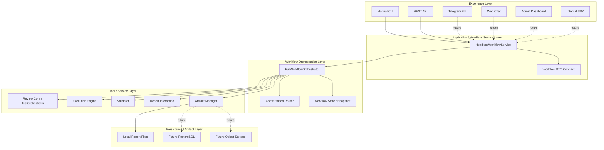
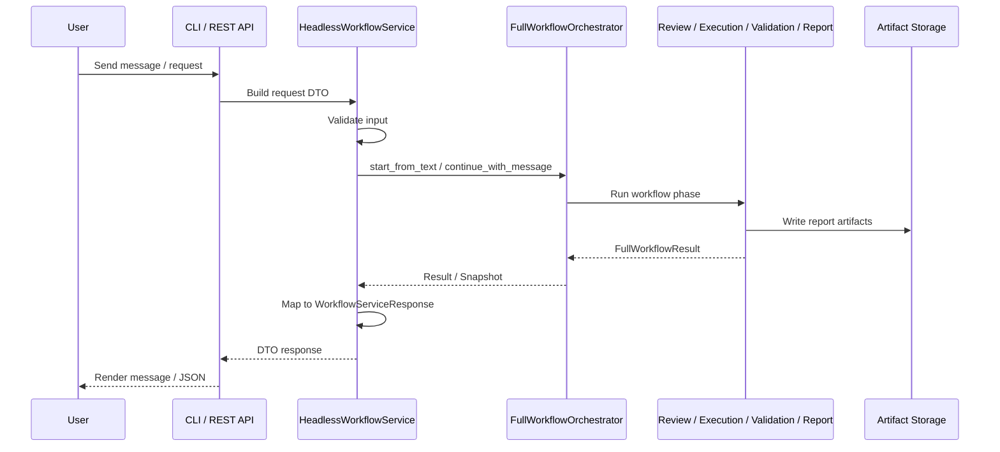
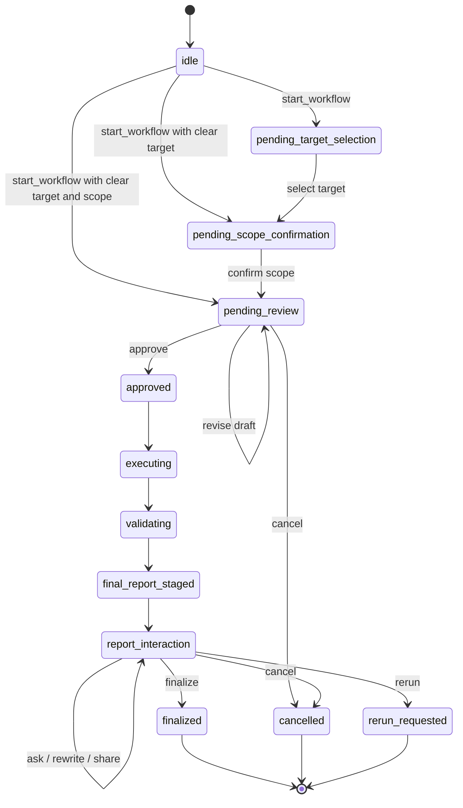
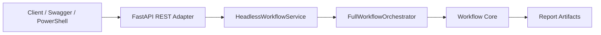
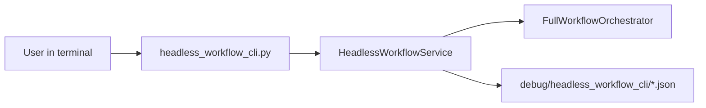
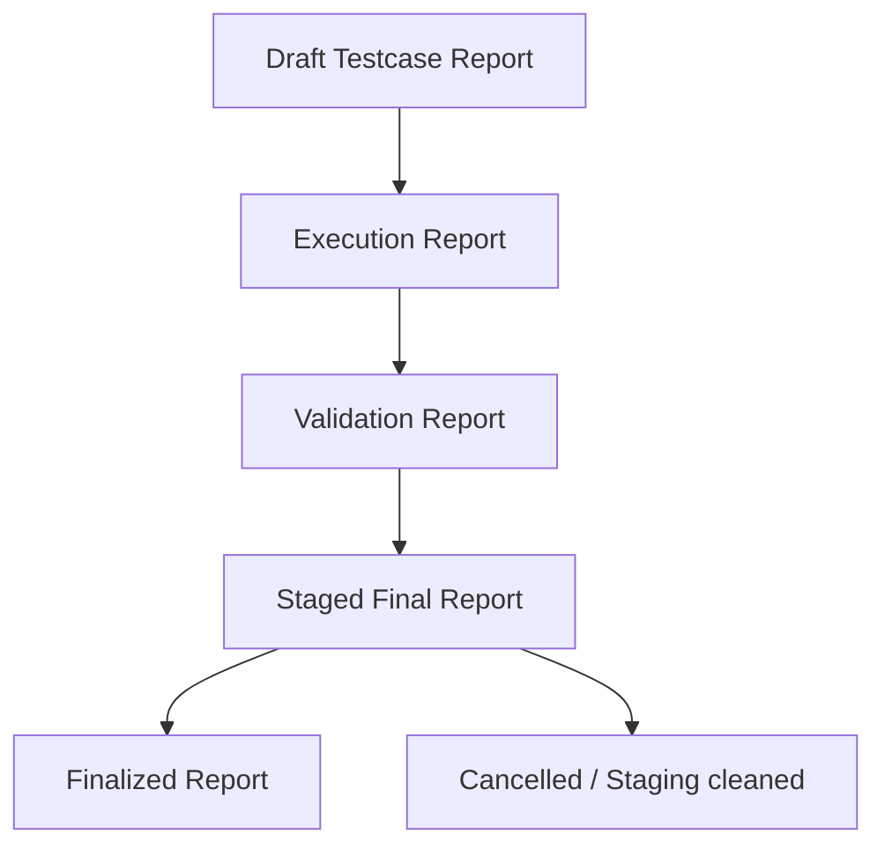

# Headless Workflow Service Architecture

## 1. Mục tiêu tài liệu

Tài liệu này mô tả kiến trúc của **Headless Workflow Service Layer** trong dự án **API Testing Agent**.

Mục tiêu của layer này là tách phần điều phối workflow kiểm thử API khỏi các giao diện bên ngoài như:

- CLI
- REST API
- Telegram Bot
- Web Chat
- Admin Dashboard
- Internal SDK

Thay vì để từng adapter gọi trực tiếp vào workflow core, tất cả adapter sẽ gọi vào một service trung tâm:

```text
HeadlessWorkflowService
```

Điều này giúp hệ thống:

- dễ mở rộng thêm giao diện mới;
- dễ kiểm thử;
- dễ triển khai thành backend service;
- giảm trùng lặp logic;
- chuẩn bị tốt cho kiến trúc microservice trong tương lai.

---

## 2. Vị trí của Headless Workflow Service trong kiến trúc tổng thể



---

## 3. Kiến trúc 8 tầng liên quan

Dự án định hướng theo kiến trúc 8 tầng:

| Tầng | Tên tầng | Vai trò |
|---|---|---|
| 1 | Experience Layer | CLI, REST API, Telegram, Web Chat, Dashboard |
| 2 | Conversation Router Layer | Hiểu message, xác định intent và workflow phase |
| 3 | Session State Layer | Lưu workflow_id, thread_id, phase, target, artifact refs |
| 4 | Workflow Orchestrators Layer | Điều phối review, execution, validation, report |
| 5 | Tool / Service Layer | OpenAPI parser, executor, validator, reporter |
| 6 | Async Task Plane | Celery/Redis trong tương lai |
| 7 | Persistence + Artifact Layer | Report files, DB, object storage |
| 8 | Governance / Observability / AI Ops | Logging, metrics, prompt registry, policy |

Trong Bước 9, trọng tâm là tạo layer:

```text
Headless Workflow Service Layer
```

Layer này nằm giữa:

```text
Experience Layer
```

và:

```text
Workflow Orchestration Layer
```

---

## 4. Nguyên tắc thiết kế

### 4.1. Adapter mỏng

Adapter chỉ làm nhiệm vụ:

- nhận input từ user/client;
- chuyển input thành request DTO;
- gọi `HeadlessWorkflowService`;
- render response ra CLI/API/UI.

Adapter không được tự xử lý workflow logic.

Không làm:

```python
orchestrator = FullWorkflowOrchestrator(settings)
orchestrator.start_from_text(...)
```

Nên làm:

```python
service = HeadlessWorkflowService(settings)
service.start_workflow(...)
```

---

### 4.2. Service là contract trung tâm

`HeadlessWorkflowService` là application service trung tâm.

Nó cung cấp các method:

```python
start_workflow(...)
continue_workflow(...)
get_workflow_status(...)
get_workflow_snapshot(...)
cancel_workflow(...)
finalize_workflow(...)
rerun_workflow(...)
list_workflow_artifacts(...)
```

Mọi adapter bên ngoài nên gọi các method này.

---

### 4.3. Không expose raw internal object

Service không trả trực tiếp:

- `FullWorkflowResult`
- `WorkflowContextSnapshot`
- graph state
- internal runtime object

Service chỉ trả DTO ổn định:

- `WorkflowServiceResponse`
- `WorkflowView`
- `WorkflowSnapshotView`
- `WorkflowArtifactView`
- `WorkflowErrorResponse`

---

### 4.4. Read-only operation không được mutate workflow

Các method sau là read-only:

```python
get_workflow_status(...)
get_workflow_snapshot(...)
list_workflow_artifacts(...)
```

Các method này không được gửi message mới vào conversation router.

Ví dụ, `get_workflow_status()` không được gọi:

```python
continue_with_message(message="status")
```

Lý do:

- tránh làm thay đổi conversation history;
- tránh trigger router decision mới;
- tránh thay đổi workflow phase ngoài ý muốn.

---

## 5. Component chính

### 5.1. `HeadlessWorkflowService`

Đường dẫn:

```text
src/api_testing_agent/application/headless_workflow_service.py
```

Vai trò:

- entrypoint application-level cho workflow;
- validate input cơ bản;
- gọi `FullWorkflowOrchestrator`;
- map result/snapshot sang DTO;
- chuẩn hóa error contract;
- bảo vệ adapter khỏi exception nội bộ;
- cung cấp read-only status/snapshot/artifacts.

---

### 5.2. `workflow_service_models.py`

Đường dẫn:

```text
src/api_testing_agent/application/workflow_service_models.py
```

Vai trò:

- định nghĩa request DTO;
- định nghĩa response DTO;
- định nghĩa actor context;
- định nghĩa error response;
- định nghĩa artifact view.

Các model chính:

```text
WorkflowActorContext
StartWorkflowRequest
ContinueWorkflowRequest
FinalizeWorkflowRequest
CancelWorkflowRequest
RerunWorkflowRequest
WorkflowView
WorkflowSnapshotView
WorkflowArtifactView
WorkflowErrorResponse
WorkflowServiceResponse
WorkflowErrorCode
```

---

### 5.3. REST Adapter

Đường dẫn:

```text
src/api_testing_agent/interfaces/rest/headless_workflow_api.py
```

Vai trò:

- cung cấp HTTP API bằng FastAPI;
- gọi vào `HeadlessWorkflowService`;
- không gọi trực tiếp workflow core.

Endpoint hiện tại:

```text
GET  /health
POST /workflows/start
POST /workflows/{thread_id}/continue
GET  /workflows/{thread_id}/status
GET  /workflows/{thread_id}/snapshot
GET  /workflows/{thread_id}/artifacts
POST /workflows/{thread_id}/finalize
POST /workflows/{thread_id}/cancel
POST /workflows/{thread_id}/rerun
```

---

### 5.4. Manual Headless CLI

Đường dẫn:

```text
src/api_testing_agent/manual_test/full_workflow/headless_workflow_cli.py
```

Vai trò:

- manual verification adapter;
- gọi `HeadlessWorkflowService`;
- hỗ trợ test nhanh start/continue/status/snapshot/artifacts/finalize/cancel/rerun;
- không thay thế CLI chính;
- không gọi trực tiếp `FullWorkflowOrchestrator`.

---

## 6. Luồng xử lý tổng quan



---

## 7. Workflow lifecycle



---

## 8. Request DTO

### 8.1. StartWorkflowRequest

Dùng để mở workflow mới.

```python
StartWorkflowRequest(
    text="test img",
    actor_context=WorkflowActorContext(...),
    thread_id=None,
    language_policy=None,
    selected_language=None,
)
```

Field:

| Field | Ý nghĩa |
|---|---|
| `text` | yêu cầu ban đầu của user |
| `actor_context` | metadata người gọi |
| `thread_id` | thread id do adapter truyền vào, optional |
| `language_policy` | adaptive/session_lock |
| `selected_language` | vi/en |

---

### 8.2. ContinueWorkflowRequest

Dùng để tiếp tục workflow hiện tại.

```python
ContinueWorkflowRequest(
    thread_id="wf-...",
    message="product",
    actor_context=WorkflowActorContext(...),
)
```

Field:

| Field | Ý nghĩa |
|---|---|
| `thread_id` | workflow thread hiện tại |
| `message` | message tiếp theo của user |
| `actor_context` | metadata người gọi |

---

### 8.3. FinalizeWorkflowRequest

Dùng để finalize workflow/report.

```python
FinalizeWorkflowRequest(
    thread_id="wf-...",
    auto_confirm=True,
    finalize_message="lưu",
    confirmation_message="đồng ý",
)
```

---

### 8.4. CancelWorkflowRequest

Dùng để hủy workflow/report session.

```python
CancelWorkflowRequest(
    thread_id="wf-...",
    auto_confirm=True,
    cancel_message="hủy",
    confirmation_message="đồng ý",
)
```

---

### 8.5. RerunWorkflowRequest

Dùng để yêu cầu rerun từ report interaction.

```python
RerunWorkflowRequest(
    thread_id="wf-...",
    instruction="chạy lại nhưng chỉ test positive",
)
```

---

## 9. Response DTO

Mọi method trả về:

```python
WorkflowServiceResponse
```

Shape tổng quát:

```python
WorkflowServiceResponse(
    ok=True,
    operation="continue_workflow",
    actor_context=WorkflowActorContext(...),
    workflow=WorkflowView(...),
    snapshot=None,
    artifacts=[],
    error=None,
)
```

Hoặc khi lỗi:

```python
WorkflowServiceResponse(
    ok=False,
    operation="continue_workflow",
    error=WorkflowErrorResponse(...),
)
```

---

## 10. WorkflowView

`WorkflowView` là view chính cho adapter render ra user.

Các field quan trọng:

| Field | Ý nghĩa |
|---|---|
| `workflow_id` | id workflow |
| `thread_id` | id thread |
| `phase` | phase hiện tại |
| `current_target` | target hiện tại |
| `assistant_message` | message hiển thị cho user |
| `status_message` | trạng thái ngắn |
| `selected_target` | target đã chọn |
| `candidate_targets` | target candidates |
| `selection_question` | câu hỏi chọn target |
| `scope_confirmation_question` | câu hỏi xác nhận scope |
| `scope_confirmation_summary` | tóm tắt scope |
| `canonical_command` | command chuẩn hóa |
| `understanding_explanation` | giải thích cách hiểu |
| `available_actions` | action hợp lệ |
| `needs_user_input` | workflow có cần user nhập tiếp không |
| `finalized` | đã finalize chưa |
| `cancelled` | đã cancel chưa |
| `rerun_requested` | có yêu cầu rerun không |
| `artifacts` | artifact refs |

---

## 11. WorkflowSnapshotView

`WorkflowSnapshotView` dùng cho debug/admin/dashboard.

Không nên render toàn bộ snapshot cho end-user thông thường.

Các field quan trọng:

| Field | Ý nghĩa |
|---|---|
| `workflow_id` | id workflow |
| `thread_id` | id thread |
| `current_phase` | phase hiện tại |
| `current_subphase` | subphase nếu có |
| `current_target` | target hiện tại |
| `original_user_text` | input ban đầu |
| `selected_target` | target đã chọn |
| `candidate_targets` | target candidates |
| `canonical_command` | command chuẩn hóa |
| `understanding_explanation` | explanation hiện tại |
| `pending_question` | câu hỏi đang chờ user |
| `last_router_decision` | router decision gần nhất |
| `last_scope_user_message` | scope message gần nhất |
| `artifact_refs` | danh sách artifact |
| `active_review_id` | review id hiện tại |
| `active_report_session_id` | report session id hiện tại |

---

## 12. Error contract

Service không để exception nội bộ đi thẳng ra adapter.

Khi lỗi, service trả:

```python
WorkflowErrorResponse(
    error_code=WorkflowErrorCode.WORKFLOW_NOT_FOUND,
    error_message="Workflow thread was not found.",
    recoverable=True,
    suggested_next_actions=["start_workflow"],
    details={...},
)
```

Error codes hiện tại:

| Error code | Ý nghĩa |
|---|---|
| `INVALID_INPUT` | input rỗng/sai |
| `WORKFLOW_NOT_FOUND` | không tìm thấy thread |
| `INVALID_PHASE_ACTION` | action sai phase |
| `TARGET_NOT_FOUND` | target không tồn tại |
| `SCOPE_SELECTION_INVALID` | scope không hợp lệ |
| `FINALIZE_NOT_ALLOWED` | finalize sai phase |
| `CANCEL_NOT_ALLOWED` | cancel sai phase |
| `RERUN_NOT_ALLOWED` | rerun sai phase |
| `INTERNAL_WORKFLOW_ERROR` | lỗi nội bộ không mong muốn |

---

## 13. REST API Architecture



REST adapter chỉ nhận HTTP request và gọi service.

REST adapter không được:

- tự chọn target;
- tự resolve scope;
- tự execute API;
- tự validate;
- tự build report;
- gọi trực tiếp `FullWorkflowOrchestrator`.

---

## 14. REST API Endpoints

### 14.1. Health check

```http
GET /health
```

Response:

```json
{
  "ok": true,
  "service": "api-testing-agent-headless-workflow-api"
}
```

---

### 14.2. Start workflow

```http
POST /workflows/start
```

Request:

```json
{
  "text": "test img",
  "actor_context": {
    "actor_id": "local_rest",
    "session_id": "rest_manual_test",
    "user_id": "local_user",
    "org_id": "local_org"
  }
}
```

Response chính:

```json
{
  "ok": true,
  "operation": "start_workflow",
  "workflow": {
    "thread_id": "wf-...",
    "phase": "pending_target_selection",
    "candidate_targets": [
      "img_local",
      "img_api_staging",
      "img_api_prod"
    ]
  }
}
```

---

### 14.3. Continue workflow

```http
POST /workflows/{thread_id}/continue
```

Request:

```json
{
  "message": "product",
  "actor_context": {
    "actor_id": "local_rest",
    "session_id": "rest_manual_test"
  }
}
```

Response:

```json
{
  "ok": true,
  "operation": "continue_workflow",
  "workflow": {
    "thread_id": "wf-...",
    "phase": "pending_scope_confirmation",
    "selected_target": "img_api_prod"
  }
}
```

---

### 14.4. Get workflow status

```http
GET /workflows/{thread_id}/status
```

Đây là read-only endpoint.

Response:

```json
{
  "ok": true,
  "operation": "get_workflow_status",
  "workflow": {
    "thread_id": "wf-...",
    "phase": "pending_scope_confirmation"
  },
  "snapshot": {
    "current_phase": "pending_scope_confirmation"
  }
}
```

---

### 14.5. Get workflow snapshot

```http
GET /workflows/{thread_id}/snapshot
```

Dùng cho debug/admin.

---

### 14.6. List workflow artifacts

```http
GET /workflows/{thread_id}/artifacts
```

Trước khi sinh draft testcase, artifact list có thể rỗng.

Sau khi vào `pending_review`, artifact list thường có:

```text
draft_report_json
draft_report_md
```

Sau khi execution/validation/report xong, artifact list có thể có:

```text
execution_report_json
execution_report_md
validation_report_json
validation_report_md
staged_final_report_json
staged_final_report_md
final_report_json
final_report_md
```

---

### 14.7. Finalize workflow

```http
POST /workflows/{thread_id}/finalize
```

Request:

```json
{
  "auto_confirm": true,
  "finalize_message": "lưu",
  "confirmation_message": "đồng ý"
}
```

Chỉ hợp lệ ở phase:

```text
report_interaction
```

---

### 14.8. Cancel workflow

```http
POST /workflows/{thread_id}/cancel
```

Request:

```json
{
  "auto_confirm": true,
  "cancel_message": "hủy",
  "confirmation_message": "đồng ý"
}
```

---

### 14.9. Rerun workflow

```http
POST /workflows/{thread_id}/rerun
```

Request:

```json
{
  "instruction": "chạy lại nhưng chỉ test positive"
}
```

Chỉ hợp lệ ở phase:

```text
report_interaction
```

---

## 15. Manual CLI Adapter Architecture



Manual CLI dùng để:

- test service nhanh;
- kiểm tra phase;
- kiểm tra artifact refs;
- kiểm tra finalize/cancel/rerun;
- debug response DTO.

Nó không phải adapter production.

---

## 16. Artifact lifecycle



Artifact stages:

| Stage | Artifact examples |
|---|---|
| `review` | `draft_report_json`, `draft_report_md` |
| `execution` | `execution_report_json`, `execution_report_md` |
| `validation` | `validation_report_json`, `validation_report_md` |
| `staged_final` | `staged_final_report_json`, `staged_final_report_md` |
| `finalized` | `final_report_json`, `final_report_md` |
| `misc` | extra artifact paths |

---

## 17. Logging

Headless service log nên có các field:

```text
thread_id
workflow_id
phase
operation
actor_id
session_id
user_id
org_id
payload_source
```

Ví dụ:

```python
logger.info(
    "Workflow continued successfully.",
    extra={
        "thread_id": result.thread_id,
        "workflow_id": result.workflow_id,
        "phase": result.phase.value,
    },
)
```

Mục tiêu:

- debug dễ hơn;
- trace được workflow;
- chuẩn bị cho observability layer sau này.

---

## 18. Testing strategy

### 18.1. Unit test

File:

```text
tests/application/test_headless_workflow_service.py
```

Mục tiêu:

- test service mà không gọi LLM/API thật;
- dùng fake orchestrator;
- kiểm tra start/continue/status/snapshot/artifacts/finalize/cancel/rerun.

Các case chính:

```text
start_workflow success
start_workflow empty input
continue_workflow missing thread
continue_workflow terminal phase
get_workflow_status read-only
get_workflow_snapshot
list_workflow_artifacts
finalize allowed/blocked
cancel allowed/blocked
rerun allowed/blocked
```

---

### 18.2. Manual CLI verification

Command:

```bash
poetry run python -m api_testing_agent.manual_test.full_workflow.headless_workflow_cli
```

Mục tiêu:

- chạy flow thật;
- xem response trong terminal;
- dump response JSON ra debug folder.

---

### 18.3. REST API verification

Run server:

```bash
poetry run uvicorn api_testing_agent.interfaces.rest.headless_workflow_api:app --reload
```

Health check:

```bash
curl http://127.0.0.1:8000/health
```

Swagger UI:

```text
http://127.0.0.1:8000/docs
```

---

## 19. Current implementation status

| Thành phần | Trạng thái |
|---|---|
| HeadlessWorkflowService | Done |
| Workflow DTO contract | Done |
| Unit test for service | Done |
| Manual headless CLI | Done |
| REST API adapter | Done |
| Swagger UI | Available via FastAPI |
| REST demo script | Planned |
| Telegram adapter | Future |
| Web chat adapter | Future |
| Admin dashboard | Future |
| Async worker/Celery | Future |
| PostgreSQL persistence | Future |

---

## 20. Lợi ích khi bảo vệ đồ án

Headless Workflow Service giúp chứng minh dự án không chỉ là chatbot đơn giản.

Nó thể hiện các năng lực kỹ thuật:

- thiết kế backend service;
- tách interface khỏi business workflow;
- có API contract rõ ràng;
- có stateful workflow;
- có testing;
- có documentation;
- có REST API chạy được;
- có khả năng mở rộng sang Telegram/Web/Dashboard;
- có khả năng phát triển thành microservice.

Một cách trình bày ngắn gọn:

> Headless Workflow Service là application service trung tâm giúp tách workflow kiểm thử API khỏi giao diện người dùng. Nhờ đó CLI, REST API, Telegram Bot hoặc Web Chat đều có thể dùng chung workflow core mà không lặp logic. Đây là nền tảng để hệ thống phát triển từ demo local thành backend service có thể triển khai thực tế.

---

## 21. Roadmap sau Headless Layer

Sau khi Bước 9 hoàn tất, các hướng tiếp theo:

### 21.1. REST demo script

Tạo script:

```text
scripts/demo_headless_rest_workflow.ps1
```

Mục tiêu:

- chạy demo API bằng PowerShell;
- gọi health/start/continue/status/artifacts;
- dùng khi demo đồ án.

---

### 21.2. REST API usage guide

Tạo file:

```text
docs/headless_rest_api_usage.md
```

Nội dung:

- cách chạy server;
- cách gọi API;
- ví dụ request/response;
- cách mở Swagger UI;
- cách debug lỗi thường gặp.

---

### 21.3. Adapter layer

Adapter tương lai:

- Telegram Bot
- Web Chat
- Admin Dashboard
- Internal SDK

Tất cả adapter này chỉ nên gọi:

```python
HeadlessWorkflowService
```

---

### 21.4. Platform layer

Mở rộng sau:

- Redis
- Celery
- PostgreSQL
- Object Storage
- metrics/tracing
- policy engine
- audit trail

---

## 22. Future Extend

```text
Adapter → HeadlessWorkflowService → FullWorkflowOrchestrator → Core Services
```

Extendence Pattern :

- REST API backend;
- Telegram Bot;
- Web UI;
- Dashboard;
- microservice-ready architecture;
- demo đồ án chuyên nghiệp hơn.